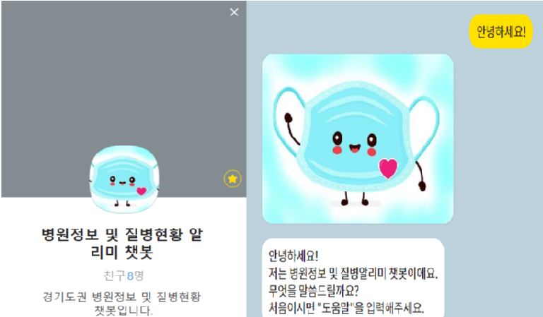
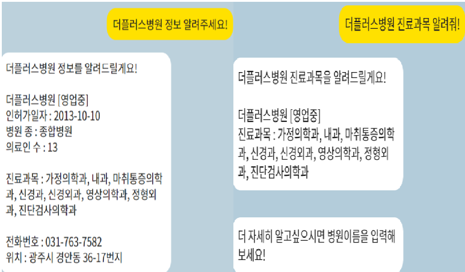
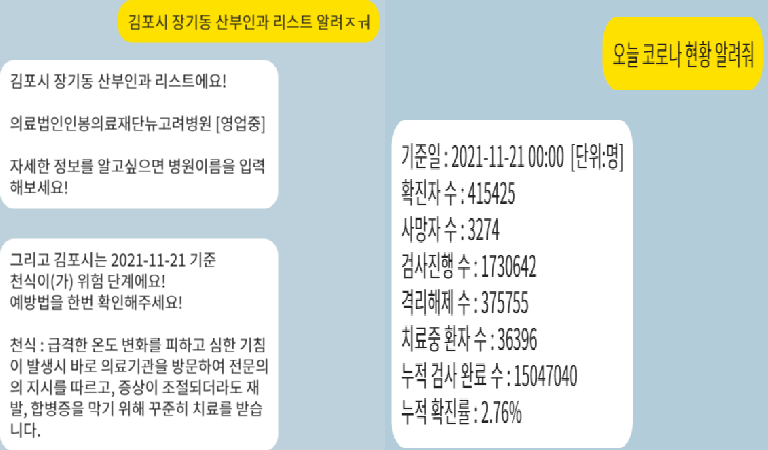
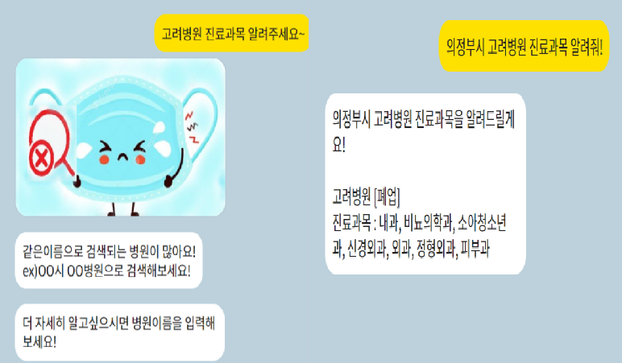

# 작품 소개
* 최근 AI 트렌드 기술들을 이용한 서비스 가운데, 접근성과 활용성, 향후 발전성등을
  모두 만족할 수 있는 챗봇 서비스를 직접 구현했습니다.
* 딥러닝과 자연어처리 기술등을 활용하여 자체 챗봇엔진을 제작했으며 필요한 학습 데이터 또한 
  직접 정제하여 만들었습니다.
* 내부 엔진 서버와 외부 API 연동 서버를 구현하여 자주 사용하는 메신저인 카카오톡과 
  연동했습니다.  
* 기능 
  1. Open API 활용
  2. [경기도권] 시,동 지역별 병원급 병원 정보제공
  3. 조건에 해당되는 병원 리스트 제공
  4. 도시별 위험 질병 경고도
  5. 코로나 현황제공
> **[작품 보고서]**(./readme/졸업작품보고서양식(2021).hwp)
  
  
  
# 개발 환경
  * 서버 구동환경 - Groom IDE
  * OS
    - windows 10
  * IDE
    - PyCharm 2021, Groom IDE
    - Language & Flask 2.0.1
    - Tensorflow - gpu2.3.0 & Keras
  * Data Base
    - AWS (RDS)
    - My SQL
  * etc
    - Kakao I Open builder, KoNLPy
  
## 시스템 구성도

* 사용자는 외부 메신저 플랫폼을 통해 데이터를 주고 받으며 챗봇 엔진 사이에서
  서로 데이터를 주고받을 수 있도록 인터페이스 역할을 하는 외부 API서버를 통해
  딥러닝 모델이 있는 내부 엔진서버와 통신하며 사용자의 의도와 개체를 분석해
  올바른 답변을 답변DB에서 select하여 역순으로 사용자에게 전달합니다.

## 챗봇엔진 구조

* 전처리 과정을 거쳐 2가지의 딥러닝 학습 모델을 거칩니다.
* 각 모델의 output으로 이루어진 키워드를 조건으로 답변DB에서 알맞은
  답변을 찾아 출력합니다.

## [의도분류 모델(CNN)](https://github.com/tmvld97/graduate-modeling/blob/master/models/intent/IntentModel.py)

* tensorflow - gpu2.3.0 & Keras
* [**accuracy** - Train : 99%, Validation : 99%, Test : 99% ](https://github.com/tmvld97/graduate-modeling/blob/master/models/intent/train_model.py)

| | Conv1 | Conv2 | Conv3 | Dense | 
:---: | :---: | :---: | :---: | :---: |
**Filters** | 128 | 128 | 128 | - |
**Kernel_size** | 3*3 | 4*4 | 5*5 | - |
**Output** | pool1 | pool2 | pool3 | 128(node) |

**Input**: seq_length(max_len = 11) Dense : sum(pooling) 
**Classification** :   
0 : 인사 
1 : 병원 정보 제공 
2 : 병원 리스트 제공 
3 : 코로나 현황 정보 제공  

## [개체인식 모델(양방향 LSTM)](https://github.com/tmvld97/graduate-modeling/blob/master/models/ner/NerModel.py)

* tensorflow - gpu2.3.0 & Keras
* [**accuracy** - F1 Score(test data) : 99%](https://github.com/tmvld97/graduate-modeling/blob/master/models/ner/train_model.py)

| | Embedding | Bidirectional Lstm | Dense |
:---: | :---: | :---: | :---: | 
**Node** | input : 1831 size : 30 | 200 | 6 (tag_size) | - |
**Activation** | - | - | softmax |

**Input** : seg_length(avg_len = 9)

## [Database](https://github.com/tmvld97/graduate-modeling/blob/master/utils/Database.py)

* Amazon(RDS) - MySQL
* MySQL workbench 8.0
* 고려사항 - multi value
* [학습모델들의 output keyword를 바탕으로 알맞은 답변 SELECT](https://github.com/tmvld97/graduate-modeling/blob/master/utils/FindAnswer.py)

## Server
1. [Engine server](https://github.com/tmvld97/graduate-modeling/blob/master/bot.py)
    * Protocol - JSON 
    * multi thred
    * Socket
    * Port tcp 5050
2. [API server](https://github.com/tmvld97/graduate-modeling/blob/master/chatbot_api/app.py)
    * Rest API
    * Flask
    * Port : 5000

## 연동
* KAKAO Chaneel 생성
* Groom IDE

## [Open API](https://github.com/tmvld97/graduate-modeling/blob/master/config/GlobalParams.py)
> 공공데이터포털 - 국민건강보험공단 질병예측 정보 
> 공공데이터포털 - 공공데이터활용지원센터_보건복지부 코로나19 감염 현황 
> 경기데이터드림 - 경기도권 병원 현황[병원급]

## 시연
 
 
 

### 참고자료
> Chatbot 시장동향 - “Marketsandmarkets, Chatbot Market, 2019”, https://www.marketsandmarkets.com/Market-Reports/smart-advisor-market-72302363.html  
> CNN관련 논문 - "CNN for Sentence Classification", http://emnlp2014.org/papers/pdf/EMNLP2014181.pdf  
> Keras 기술문서 - "KERAS", https://keras.io/  
> Rest API - "히진쓰의 서버사이드 기술 블로그", https://khj93.tistory.com/entry/%EB%84%A4%ED%8A%B8%EC%9B%8C%ED%81%AC-REST-API%EB%9E%80-REST-RESTful%EC%9D%B4%EB%9E%80
