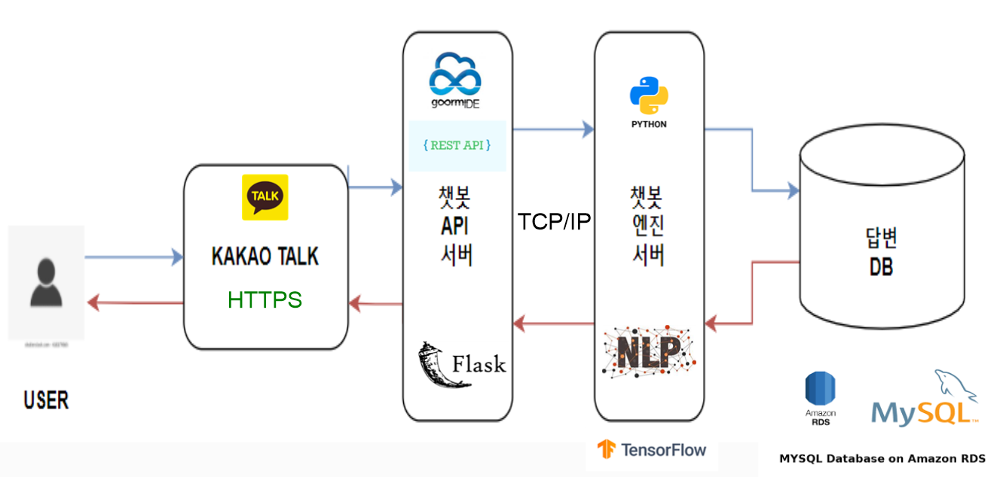
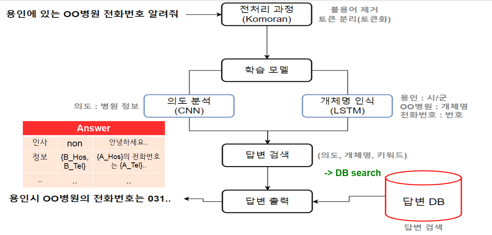
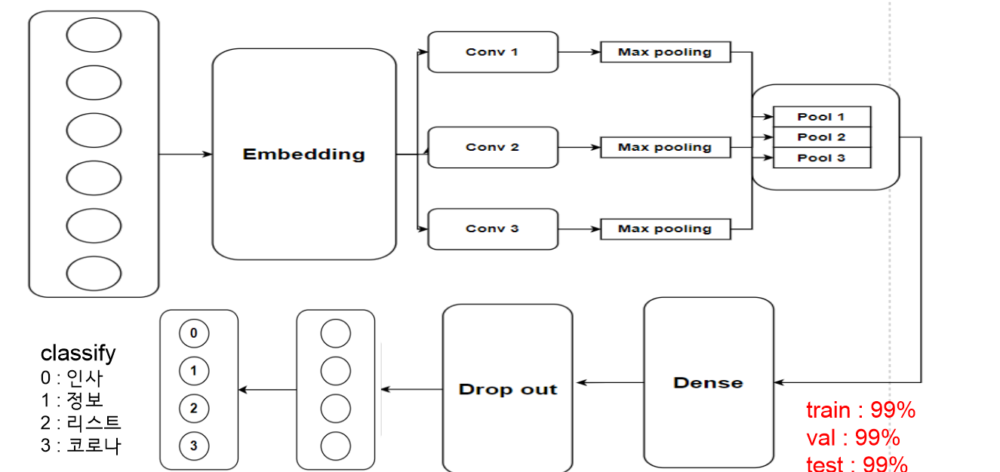
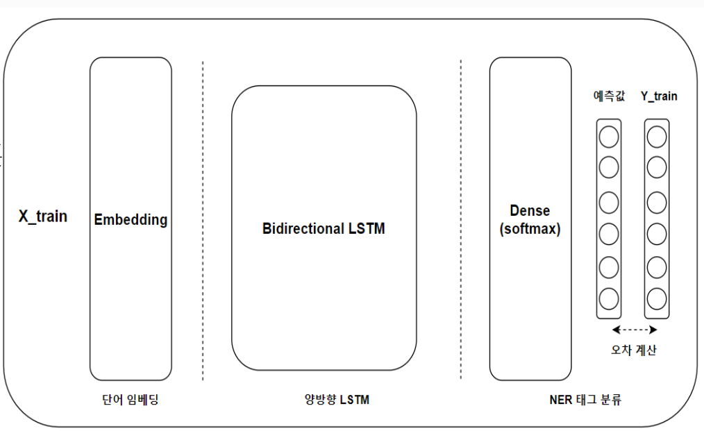
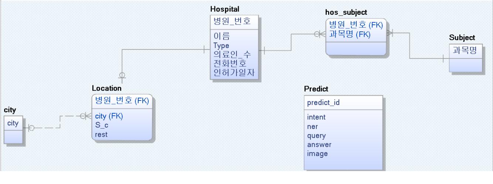

# 작품 소개
* 최근 AI 트렌드 기술들을 이용한 서비스 가운데, 접근성과 활용성, 향후 발전성등을
  모두 만족할 수 있는 챗봇 서비스를 직접 구현했습니다.
* 딥러닝과 자연어처리 기술등을 활용하여 자체 챗봇엔진을 제작했으며 필요한 학습 데이터 또한 
  직접 정제하여 만들었습니다.
* 내부 엔진 서버와 외부 API 연동 서버를 구현하여 자주 사용하는 메신저인 카카오톡과 
  연동했습니다.
* Open API를 활용하여 경기도권의 지역별 병원정보 및 조건에 해당되는 병원정보를 제공하며
  도시별 위험 질병 경고도, 코로나 현황등의 정보를 제공합니다.

# 개발 환경
  * 서버 구동환경 - Groom IDE
  * OS
    - windows 10
  * IDE
    - PyCharm 2021, Groom IDE
    - Language & Flask 2.0.1
    - Tensorflow - gpu2.3.0 & Keras
  * Data Base
    - AWS (RDS)
    - My SQL
  * etc
    - Kakao I Open builder, KoNLPy
  
# 시스템 구성도

* 사용자는 외부 메신저 플랫폼을 통해 데이터를 주고 받으며 챗봇 엔진 사이에서
  서로 데이터를 주고받을 수 있도록 인터페이스 역할을 하는 외부 API서버를 통해
  딥러닝 모델이 있는 내부 엔진서버와 통신하며 사용자의 의도와 개체를 분석해
  올바른 답변을 답변DB에서 select하여 역순으로 사용자에게 전달합니다.

# 챗봇엔진 구조

* 전처리 과정을 거쳐 2가지의 딥러닝 학습 모델을 거칩니다.
* 각 모델의 output으로 이루어진 키워드를 조건으로 답변DB에서 알맞은
  답변을 찾아 출력합니다.

# 의도분류 모델(CNN)

* tensorflow - gpu2.3.0 & Keras
* **accuracy** - Train : 99%, Validation : 99%, Test : 99%
|제목 셀1|제목 셀2|제목 셀3|제목 셀4|
|---|---|---|---|
|내용 1|내용 2|내용 3|내용 4|
|내용 5|내용 6|내용 7|내용 8|
|내용 9|내용 10|내용 11|내용 12|

# 개체인식 모델(양방향 LSTM)

* tensorflow - gpu2.3.0 & Keras
* **accuracy** - F1 Score(test data) : 99% 
# Database

* Amazon(RDS) - MySQL
* 고려사항 - multi value 

